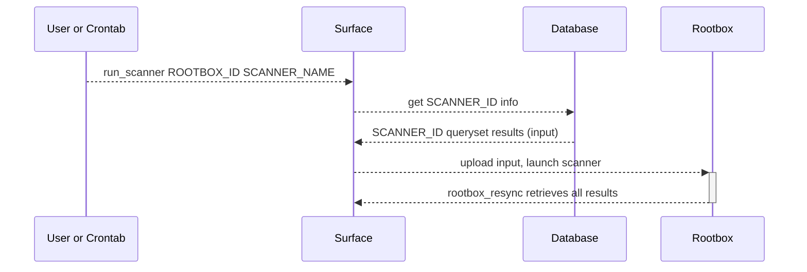
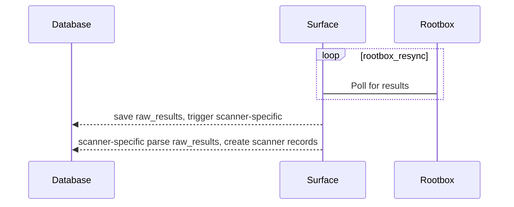

## Flow (proposal)

### Initial setup for rootboxes
- `ssh root@IP`
- `useradd surface`
- `mkdir -p /home/surface/.ssh; vi /home/surface/.ssh/authorized_keys`
- `chown -R surface /home/surface; chmod 700 /home/surface/.ssh; chmod 600 /home/surface/.ssh/authorized_keys` (insert public key)
- `vi /etc/ssh/sshd_config` (change ssh port to 443)
- `iptables -I INPUT -p tcp --dport 443 -j ACCEPT`
- `vi /etc/sudoers` (add next content `surface ALL=(ALL)       NOPASSWD: ALL`)
- `systemctl restart sshd`

- If rootbox is on AWS (note: on aws we have centos as a user):
    - For Linux: `curl -O https://inspector-agent.amazonaws.com/linux/latest/install`
    - `sudo bash install`
    - `sudo package-cleanup --oldkernels --count=1`

### Launch scan

- `docker exec surface_surface_1 ./manage.py run_scanner -s root_box_1 nmap`

### Retrieve Results

### Drill-down

* User launches a scanner from django admin or a scheduler runs the management command
* Surface retrieves `SCANNER_ID` info from DB: `name`, `queryset` and `parser` (TBD)
* Surface executes `queryset` generating an input file
* Surface runs ansible task to upload input file to temporary directory `/scanners/SCANNER_ID/TIMESTAMP/input/INPUTFILE`
* Surface runs ansible task to launch scanner `docker run -d -v /scanners/SCANNER_ID/TIMESTAMP/input:/input -v /scanners/SCANNER_ID/TIMESTAMP/output:/output registry.gitlab.com/surface/scanners/registry/SCANNER`
* Scanner docker entrypoint will read input file from `/input/INPUTFILE` and produce an output file for each target/line in `/output/`. **NOTE:** Files should only be placed in `/output` once they are fully ready to be processed

In parallel, `rootbox_resync`:

* Polls each rootbox for new files in `/scanners/*/*/output/`
* Each file found is imported to `raw_results`, indexed on `SCANNER_ID` and `TIMESTAMP` (taken from directory names)
* `parser` for the `SCANNER_ID` is triggered
